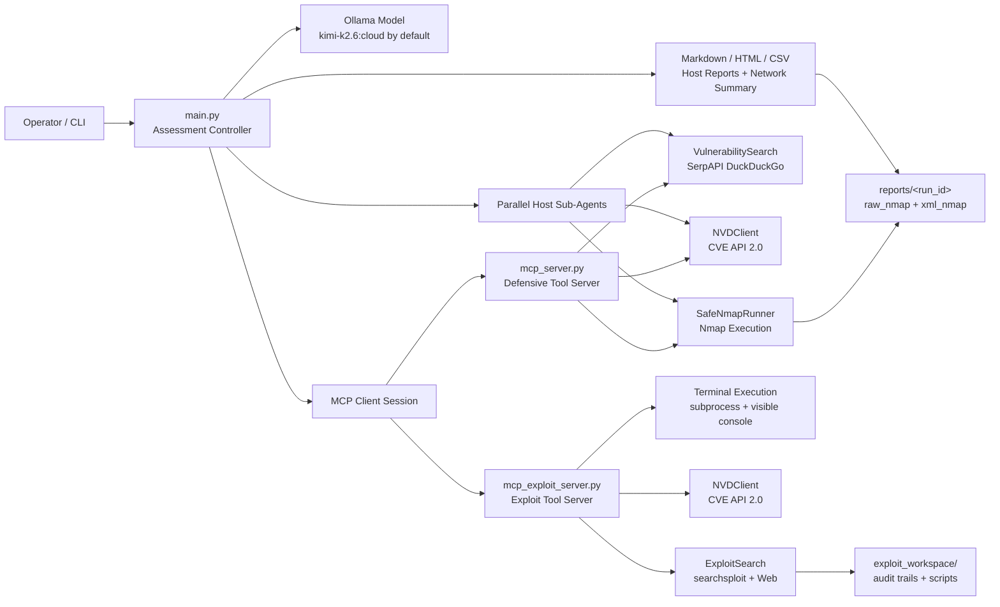
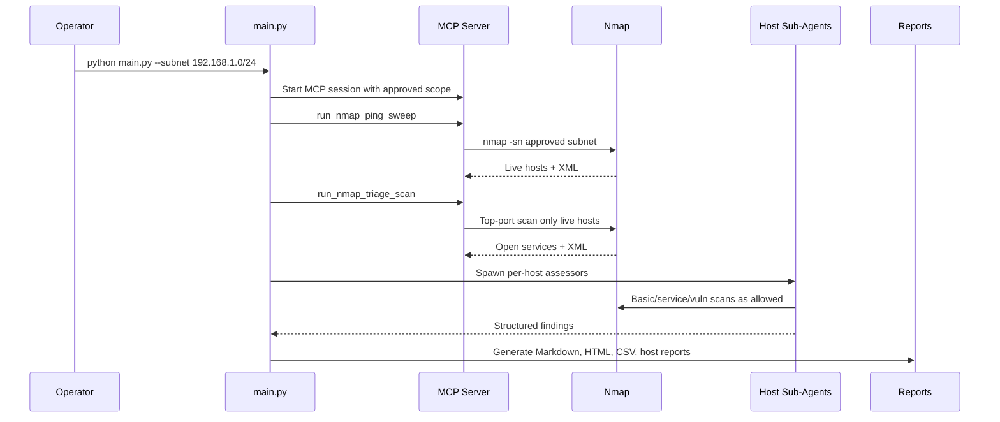
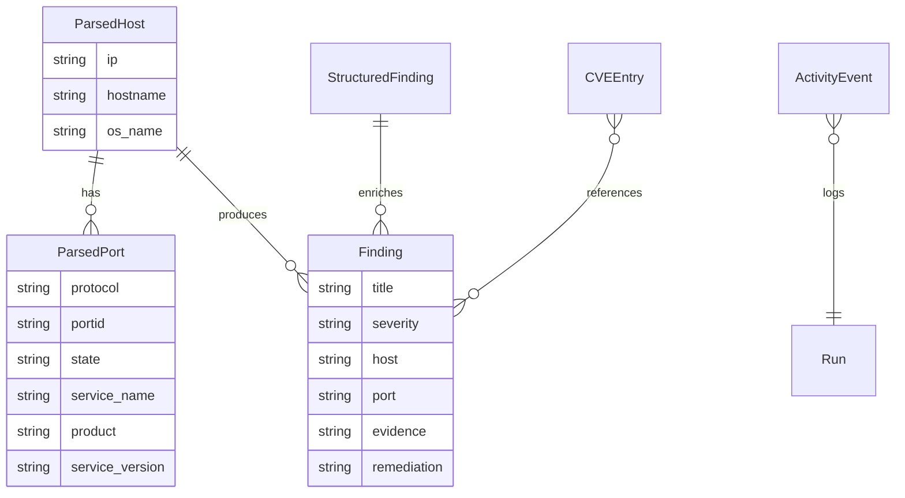

# NetCheckAI

> Your AI-powered network security copilot for fast, scoped, evidence-backed assessments.

[](https://www.python.org/)
[](https://nmap.org/)
[](https://modelcontextprotocol.io/)
[](https://ollama.com/)
[](https://docs.pytest.org/)
[](LICENSE)

NetCheckAI makes internal network assessments dramatically faster without turning your workflow into a black box. It combines trusted Nmap scanning with AI-guided triage, host prioritization, CVE enrichment, and ready-to-share reporting.

Instead of deep-scanning everything and drowning in output, NetCheckAI helps you:

- Find what is actually exposed
- Focus on the hosts most likely to matter
- Produce audit-friendly reports your team can act on immediately

Built-in guardrails keep scans inside approved private ranges, enforce evidence-driven scan flow, and preserve raw artifacts for verification and compliance. Optional exploitation mode is available for authorized testing with approval gates and full audit trails.

---

## Product Overview

NetCheckAI is designed for security teams that need speed, signal, and control in one tool.

### Why teams choose NetCheckAI

- **Cut noise:** triage-first logic prioritizes likely-risky hosts before deeper scans.
- **Move faster:** AI assists with analysis, enrichment, and next-step recommendations.
- **Stay in control:** scope limits, command restrictions, and approval workflows are enforced in code.
- **Prove your work:** raw outputs, structured findings, and reports are saved per run.

The workflow is simple: discover live hosts, triage exposure, go deeper only where evidence supports it, then generate reports for remediation, audits, and retesting.

| Dimension | What NetCheckAI Does |
|---|---|
| Primary use case | Defensive local-network discovery, triage, service review, remediation reporting, and optional AI-driven exploitation of confirmed CVEs |
| Target users | Security engineers, consultants, blue teams, pentesters, lab operators, DevSecOps teams |
| Control model | Runtime-approved private CIDRs, strict command allowlists, tool-call budgets, optional manual approval, per-action exploit approvals |
| AI role | Plans assessment flow, selects suspicious hosts, enriches findings, summarizes remediation, researches and executes exploits against authorized targets |
| Evidence model | Nmap text output, Nmap XML, per-host report files, structured findings, exploit audit trails, JSONL activity logs |
| Output | Markdown network summary, per-host Markdown reports, optional HTML and CSV reports, exploit workspace artifacts |

### Key Differentiators

| Differentiator | Why It Matters |
|---|---|
| Triage-first scanning | Avoids blindly deep-scanning every live host and focuses time on exposed services that matter |
| Safety enforced in code | Scope and command restrictions live in Python validation, not just in prompts |
| MCP-native tool boundary | The model can only call exposed defensive tools through the MCP server |
| Parallel host sub-agents | Suspicious hosts can be assessed concurrently with per-host tool budgets |
| Deterministic reporting | Reports are generated from parsed XML, policy state, and structured sub-agent output |
| Audit-ready artifacts | Raw Nmap output, XML, activity logs, and generated reports are stored per run |

---

## Screenshots And Demo

This repository contains a CLI experience and generated report artifacts, not a browser frontend. Suggested screenshots for the project page:

| Screenshot | Suggested File | Description |
|---|---|---|
| CLI run header | `docs/images/cli-run.png` | Model, approved scope, transport, profile, and approval mode |
| Activity log | `docs/images/activity-log.png` | Ping sweep, triage, sub-agent activity, blocked actions, and report generation |
| Network summary | `docs/images/network-summary.png` | Executive summary, scope coverage, findings by priority, and host inventory |
| Host report | `docs/images/host-report.png` | Evidence model, inferred role, open ports, and recommended follow-up |
| CSV export | `docs/images/findings-csv.png` | Structured findings ready for ticketing, spreadsheets, or SIEM ingestion |

```markdown


```

---

## Feature Breakdown

### Core Features

| Feature | Details |
|---|---|
| Approved subnet assessment | Accepts explicit private IPv4 CIDRs only |
| Ping sweep discovery | Starts with `nmap -sn` before any port-level scan |
| Triage scan | Scans only hosts discovered alive, using profile-specific subnet arguments |
| Host selection | Scores open services and ranks hosts by exposure indicators |
| Deeper host scans | Supports basic, service/script/OS, and vulnerability-script scans in enforced order |
| Report generation | Produces network summaries, host reports, CSV, and HTML |
| Run artifacts | Stores raw Nmap output, XML Nmap output, MCP server logs, and JSONL activity logs |
| Interactive menu | Uses `questionary` for guided local runs and saved preferences |

### Developer Features

| Feature | Details |
|---|---|
| MCP tool server | `mcp_server.py` exposes restricted scan and lookup tools over stdio or local HTTP |
| Typed Python data models | Dataclasses model parsed hosts, ports, findings, CVEs, and sub-agent results |
| Test suite | Pytest coverage for scope validation, allowlists, report generation, parsing, and sub-agents |
| Config-first behavior | `config.yaml` controls profiles, limits, reporting, search, history, and transport |
| Deterministic parsers | Nmap XML is parsed into structured host and port records |
| CLI flags | Supports transport, model, reports directory, approval mode, output formats, profiles, and sub-agent controls |

### Performance Features

| Feature | Details |
|---|---|
| Discovery batching | Independent discovery and triage tool calls can be executed concurrently |
| Parallel sub-agents | Suspicious hosts can be processed concurrently with configurable limits |
| Context compaction | Older tool results are compacted for sub-agent model loops |
| XML registry | Parsed Nmap XML is cached in-memory during a run to avoid repeat parsing |
| Search caching | Vulnerability intelligence and NVD lookups use lightweight TTL/LRU-style caches |
| Output limits | Nmap output and report inputs are capped to keep model context bounded |

### Security Features

| Feature | Details |
|---|---|
| RFC1918 scope enforcement | Public, loopback, multicast, unspecified, and oversized ranges are rejected |
| Runtime-approved scope | Host scans must stay inside explicitly approved subnets |
| Discovery prerequisite | Host-level scans require prior ping sweep evidence |
| Triage prerequisite | Host-level scans can require triage before deeper scanning |
| Command allowlist | `run_limited_terminal` accepts only known safe Nmap command shapes |
| Active-check gate | Optional generated checks require discovered-live + triaged host evidence; default mode also requires host and per-command approval |
| Shell metacharacter rejection | Command and search inputs reject shell metacharacters |
| Offensive term blocking | Search blocks terms such as exploit payloads, brute force tooling, and Metasploit references |
| Private data protection | Private IP addresses and local hostnames are blocked from public web search |
| Local-only HTTP MCP | HTTP transport may bind only to `127.0.0.1` or `localhost` |
| Secrets handling | API keys are read from environment variables and redacted in search URLs |

### AI Features

| Feature | Details |
|---|---|
| Ollama controller | Main assessment loop uses an Ollama chat model configured in `config.yaml` |
| MCP tool calling | Model actions are constrained to MCP-exposed defensive tools |
| Per-host sub-agents | Focused workers assess suspicious hosts after triage completes |
| Structured sub-agent findings | Sub-agents return JSON-style findings with risk, evidence, remediation, researched services, and CVEs |
| Defensive system prompts | Prompts prohibit unauthorized targets, brute force, payloads, persistence, and unapproved active behavior |
| User-approved active checks | Optional mode lets sub-agents propose custom Python or reviewed commands for approved hosts only |
| CVE enrichment | Known product/version strings can be checked against NVD CVE API 2.0 |

### Enterprise-Relevant Features

| Capability | Current State |
|---|---|
| Audit trail | JSONL activity log per run |
| Evidence retention | Raw and XML Nmap artifacts stored under timestamped run directories |
| Report exports | Markdown, HTML, and CSV |
| Configurable limits | Max hosts, tool calls, searches, subnet size, report input size, timeouts, and concurrency |
| Approval modes | `auto`, `review`, and `manual` workflows |
| Trend comparison | A comparison helper exists in `tools/report_generator.py`; full historical comparison is configured but only partially wired into the current main reporting path |
| RBAC / multi-user | Not implemented in this repository |
| Central database | Not implemented in this repository |

---

## Architecture

NetCheckAI is a local-first Python application with an MCP server boundary around scanning and vulnerability-intelligence operations.



### Frontend Stack

There is no web frontend in the current repository. The user interface is a terminal application:

| Component | Technology |
|---|---|
| CLI entrypoint | `main.py` |
| Friendly launcher | `app.py` |
| Interactive prompts | `questionary` |
| Activity display | Plain terminal output with JSONL audit trail |
| Generated report UI | Static HTML report produced by `tools/report_generator.py` |

### Backend Stack

| Layer | Implementation |
|---|---|
| Language | Python |
| Controller | `main.py` |
| Defensive tool server | `mcp_server.py` using MCP `FastMCP` |
| Exploit tool server | `mcp_exploit_server.py` using MCP `FastMCP` |
| Scanner | Nmap via `subprocess.run` / `asyncio.create_subprocess_exec` with `shell=False` |
| Config | YAML via `PyYAML` |
| LLM runtime | Ollama Python client |
| HTTP transport | `uvicorn` + `starlette` for local MCP HTTP mode |
| Tests | `pytest` and `pytest-asyncio` |

### MCP Tool Surface

| Tool | Purpose | Guardrails |
|---|---|---|
| `run_nmap_ping_sweep(subnet)` | Discovery with `nmap -sn` | Approved private subnet only |
| `run_nmap_triage_scan(subnet)` | Top-port triage for discovered live hosts | Requires ping sweep |
| `run_nmap_basic_scan(ip)` | Service/version detection on one host | Requires discovered live host |
| `run_nmap_service_scan(ip)` | `-sV -sC -O` service/script/OS scan | Requires basic scan |
| `run_nmap_vuln_scan(ip)` | Nmap `vuln` NSE scripts | Requires service scan |
| `run_limited_terminal(command)` | Compatibility wrapper for allowlisted Nmap commands | Rejects all non-allowlisted commands |
| `search_vulnerability_intel(query)` | Defensive public vulnerability/advisory search | Sanitized, no private IPs, no offensive terms |
| `search_cve_intel(query)` | NVD CVE lookup for known product/version strings | Sanitized query, rate-limited and cached |

Active custom checks are not exposed through the MCP server. They are local host sub-agent tools only, and are available only when `--active-checks` or `active_checks.enabled` is set. `preapproved` consent mode is high risk: the model will not stop for host or command prompts, so a bad generated check could disrupt an in-scope device even though scope checks, blocked primitives, timeouts, and audit logs still apply.

### Exploit MCP Tool Surface (mcp_exploit_server.py)

The exploit server runs on a separate port (default 8001) and exposes permissive tools for authenticated exploitation. These tools are only available when `--exploit` is passed.

| Tool | Purpose | Guardrails |
|---|---|---|
| `run_exploit_terminal(command)` | Execute any command in a dedicated visible terminal | Target-scoped, timeout-enforced, audit-logged |
| `write_python_file(filename, code)` | Save generated Python exploit script | SHA256-hashed, workspace-contained |
| `run_python_file(target_ip, filename)` | Execute saved Python exploit in visible terminal | Target IP mandatory, timeout-enforced |
| `search_exploit_db(query)` | Search local exploit-db via searchsploit | No sanitization (offensive terms allowed) |
| `search_web_exploit(query)` | Unsandboxed web search for PoC/exploit code | No sanitization (offensive terms allowed) |
| `search_cve_intel(query)` | NVD CVE lookup by ID or product/version | Rate-limited, cached |
| `run_msf_module(module, target_ip, options)` | Launch Metasploit module against target | Target IP mandatory, timeout-enforced |
| `read_workspace_file(filename)` | Read files from exploit workspace | Path-traversal protected |
| `list_workspace()` | List all files in exploit workspace | Read-only |
| `check_os(target_ip)` | Detect target OS via TTL analysis and port probing | Read-only, non-intrusive |

The permission mode (`--exploit-permission`) applies at the policy layer in `exploit_agent.py`, not in the MCP server. In `full_access` mode all tool calls are auto-approved; in `approve_only` mode the user must type `ALLOW <target>` for each action.

### Auth And Identity

NetCheckAI does not implement user accounts, OAuth, SSO, RBAC, or API authentication. Trust is currently local and operator-driven:

| Area | Current Behavior |
|---|---|
| Operator identity | Local terminal user |
| Scan authorization | Explicit `--subnet` values or interactive subnet selection |
| MCP HTTP exposure | Localhost-only binding |
| Approval | CLI approval modes and policy checks |

### Database

There is no database engine, ORM, migration system, or schema file in the current codebase. Runtime state is kept in memory and persisted as files under `reports/<run_id>/`.

| Data | Storage |
|---|---|
| Activity events | `reports/<run_id>/activity.jsonl` |
| Raw scan output | `reports/<run_id>/raw_nmap/*.txt` |
| Structured scan output | `reports/<run_id>/xml_nmap/*.xml` |
| Network summary | `reports/<run_id>/network_summary.md` |
| Host reports | `reports/<run_id>/host_<ip>.md` |
| CSV findings | `reports/<run_id>/findings.csv` |
| HTML summary | `reports/<run_id>/network_summary.html` |
| Interactive preferences | `~/.config/ai-powered-nmap/history.yaml` |

### Deployment Model

NetCheckAI is designed to run locally on an operator workstation or assessment VM with Nmap installed. It can use either stdio MCP transport in a single process tree or a localhost HTTP MCP server for workflows that benefit from parallelism.



---

## Folder Structure

```text
NetCheckAi/
+-- app.py
+-- config.yaml
+-- LICENSE
+-- main.py
+-- mcp_server.py
+-- mcp_exploit_server.py
+-- README.md
+-- requirements.txt
+-- reports/
|   +-- 20260428_085908/
|   |   +-- activity.jsonl
|   |   +-- host_192.168.1.1.md
|   |   +-- host_192.168.1.130.md
|   |   +-- host_192.168.1.208.md
|   |   +-- mcp_server.log
|   |   +-- network_summary.md
|   |   +-- raw_nmap/
|   |   +-- xml_nmap/
|   +-- 20260428_101321/
|       +-- activity.jsonl
|       +-- mcp_server.log
|       +-- raw_nmap/
|       +-- xml_nmap/
+-- tests/
|   +-- __init__.py
|   +-- test_active_checks.py
|   +-- test_command_allowlist.py
|   +-- test_cve_lookup.py
|   +-- test_nmap_runner.py
|   +-- test_report_generation.py
|   +-- test_search_sanitization.py
|   +-- test_sub_agents.py
|   +-- test_subnet_validation.py
|   +-- test_triage_parsing.py
+-- tools/
    +-- __init__.py
    +-- active_checks.py
    +-- activity_log.py
    +-- cve_lookup.py
    +-- exploit_agent.py
    +-- exploit_search.py
    +-- interactive_ui.py
    +-- nmap_tools.py
    +-- report_generator.py
    +-- search_tools.py
    +-- sub_agents.py
```

Generated Python cache directories (`__pycache__/`) and `.pytest_cache/` may exist locally and are not required for operation.

---

## Installation

### Prerequisites

| Requirement | Notes |
|---|---|
| Python | Python 3.12+ is recommended based on local cache and dependency usage |
| Nmap | Must be installed and available on `PATH`, or configured via `nmap.path` |
| Ollama | Required for AI controller and sub-agent model calls |
| Network authorization | Only scan networks you own or are explicitly authorized to assess |
| Optional SerpAPI key | Enables configured public vulnerability-intelligence search if required by your plan |
| Optional NVD API key | Improves NVD API rate limits |

### 1. Clone And Enter The Repository

```bash
git clone <your-repo-url> NetCheckAi
cd NetCheckAi
```

### 2. Create A Virtual Environment

```bash
python -m venv .venv
source .venv/bin/activate
```

On Windows PowerShell:

```powershell
python -m venv .venv
.\.venv\Scripts\Activate.ps1
```

### 3. Install Python Dependencies

```bash
python -m pip install --upgrade pip
python -m pip install -r requirements.txt
```

### 4. Install And Verify Nmap

```bash
nmap --version
```

If Nmap is not on `PATH`, set its executable path in `config.yaml`:

```yaml
nmap:
  path: "C:\\Program Files (x86)\\Nmap\\nmap.exe"
```

### 5. Configure Ollama

The default model in `config.yaml` is:

```yaml
ollama:
  model: "kimi-k2.6:cloud"
```

Verify your Ollama runtime can access the configured model:

```bash
ollama show kimi-k2.6:cloud
```

You can override the model at runtime:

```bash
python main.py --subnet 192.168.1.0/24 --model <ollama-model-name>
```

### 6. Configure Optional Intelligence Keys

```bash
export SERPAPI_API_KEY="your-serpapi-key"
export NVD_API_KEY="your-nvd-api-key"
```

On Windows PowerShell:

```powershell
$env:SERPAPI_API_KEY="your-serpapi-key"
$env:NVD_API_KEY="your-nvd-api-key"
```

### 7. Run A Local Assessment

```bash
python main.py --subnet 192.168.1.0/24
```

Alternative launcher:

```bash
python app.py --subnet 192.168.1.0/24
```

If you run `python main.py` with no arguments in an interactive terminal, NetCheckAI opens the guided menu.

---

## Configuration

The main configuration file is `config.yaml`.

### Scan Profiles

| Profile | Purpose | Nmap Behavior |
|---|---|---|
| `quick` | Fast discovery and path visibility | Ping sweep plus traceroute-style subnet profile; no host port depth |
| `standard` | Default defensive workflow | Ping sweep, top-100 triage, selective top-1000 service detection |
| `deep` | Broader selected service review | More complete service scripts and OS detection for selected hosts |
| `web` | HTTP/TLS-focused review | HTTP title, headers, TLS certificate and cipher checks |
| `windows` | SMB-focused review | SMB security mode and protocol checks |
| `udp-light` | Limited UDP visibility | Top UDP ports with strict timeout |

Example:

```bash
python main.py --subnet 10.0.0.0/24 --profile web
```

### Approval Modes

| Mode | Behavior |
|---|---|
| `auto` | Model proposes actions; policy enforces whether they can run |
| `review` | Actions are shown as pending in the CLI |
| `manual` | Operator must approve each scan action |

```bash
python main.py --subnet 192.168.1.0/24 --approval-mode manual
```

### Output Formats

| Format | File |
|---|---|
| `markdown` | `network_summary.md` and per-host Markdown reports |
| `html` | `network_summary.html` |
| `csv` | `findings.csv` |
| `all` | Markdown, HTML, and CSV |

```bash
python main.py --subnet 192.168.1.0/24 --output all
```

---

## Environment Variables

| Variable | Used By | Required | Description |
|---|---|---:|---|
| `APPROVED_SUBNETS` | `mcp_server.py` | MCP server direct use only | Comma-separated approved private CIDRs when launching the MCP server manually |
| `REPORTS_DIR` | `mcp_server.py` | No | Overrides where MCP server scan artifacts are written |
| `DISABLE_VULN_SEARCH` | `main.py`, `mcp_server.py` | No | Set to `1` to disable public vulnerability-intelligence search |
| `SERPAPI_API_KEY` | `tools/search_tools.py` | No | API key for the configured SerpAPI DuckDuckGo endpoint |
| `NVD_API_KEY` | `tools/cve_lookup.py` | No | API key for NVD CVE API 2.0 |

The configured environment variable names for SerpAPI and NVD can be changed in `config.yaml`:

```yaml
search:
  api_key_env: "SERPAPI_API_KEY"

cve_lookup:
  api_key_env: "NVD_API_KEY"
```

---

## CLI Reference

```bash
python main.py [options]
```

| Option | Description |
|---|---|
| `--subnet <cidr>` | Approved RFC1918 subnet. Can be passed multiple times |
| `--mcp-transport stdio\|http` | MCP transport mode |
| `--model <name>` | Ollama model override |
| `--reports-dir <path>` | Base directory for generated reports |
| `--max-hosts <n>` | Override max host-level assessment count |
| `--config <path>` | YAML config path |
| `--http-port <port>` | Local HTTP MCP port for defensive server |
| `--plain` | Disable any remaining fancy formatting |
| `--no-search` | Disable public vulnerability-intelligence search |
| `--profile <name>` | Scan profile: `quick`, `standard`, `deep`, `web`, `windows`, `udp-light` |
| `--approval-mode <mode>` | `auto`, `review`, or `manual` |
| `--output <format>` | `markdown`, `html`, `csv`, or `all` |
| `--no-sub-agents` | Disable parallel per-host sub-agents |
| `--sub-agent-concurrency <n>` | Max concurrent host sub-agent scans |
| `--max-sub-agent-rounds <n>` | Max model/tool rounds per sub-agent |
| `--active-checks` | Enable user-approved active custom checks for scan-discovered, triaged hosts |
| `--active-consent-mode <mode>` | `per-command` prompts for each active command; `preapproved` skips prompts after startup warning |
| `--exploit` | Enable AI-driven exploitation |
| `--exploit-mode <mode>` | `integrated` (exploit targets found during scan) or `standalone` (exploit specific target) |
| `--exploit-permission <mode>` | `full_access` (AI auto-executes) or `approve_only` (user confirms each action) |
| `--exploit-target <ip>` | Target IP for standalone exploit mode (required) |
| `--exploit-cve <cve>` | Specific CVE to exploit in standalone mode (optional) |

---

## API Documentation

NetCheckAI does not expose a conventional REST API in the current repository. Its programmatic interface is the MCP tool server in `mcp_server.py`.

### Start The MCP Server Directly

Stdio transport:

```bash
python mcp_server.py \
  --transport stdio \
  --approved-subnets 192.168.1.0/24 \
  --reports-dir reports/manual
```

Local HTTP transport:

```bash
python mcp_server.py \
  --transport http \
  --host 127.0.0.1 \
  --port 8000 \
  --approved-subnets 192.168.1.0/24 \
  --reports-dir reports/manual
```

The HTTP transport intentionally rejects non-localhost binds.

### MCP Tool Examples

#### `run_nmap_ping_sweep`

Request:

```json
{
  "subnet": "192.168.1.0/24"
}
```

Response shape:

```text
COMMAND: nmap -sn 192.168.1.0/24
TARGET: 192.168.1.0/24
RAW_REPORT: none
OUTPUT:
EXIT_CODE: 0
STDOUT:
...

LIVE_HOSTS:
2 live host(s) discovered in 192.168.1.0/24:
- 192.168.1.1
- 192.168.1.10
```

#### `run_nmap_triage_scan`

Request:

```json
{
  "subnet": "192.168.1.0/24"
}
```

Response includes triage hints and a compact summary when XML parsing succeeds:

```text
TRIAGE_HINTS:
Use this ranked list to choose only suspicious hosts for deeper scans.
- 192.168.1.1: medium triage score 3; remote login surface: 22/tcp ssh OpenSSH 8.4

COMPACT_SUMMARY:
- 192.168.1.1 ports=[22/tcp:ssh/OpenSSH-8.4; 80/tcp:http]
```

#### `run_nmap_basic_scan`

Request:

```json
{
  "ip": "192.168.1.1"
}
```

Blocked response example:

```text
BLOCKED: 192.168.1.1 was not reported alive by the prerequisite ping sweep; refusing host scan.
```

#### `search_vulnerability_intel`

Request:

```json
{
  "query": "Apache HTTPD 2.4.41"
}
```

Blocked response example:

```text
BLOCKED: do not send private IP addresses or local hostnames to web search.
```

#### `search_cve_intel`

Request:

```json
{
  "query": "OpenSSH 8.4"
}
```

Response shape:

```text
CVE results for: OpenSSH 8.4

- CVE-...
  CVSS: ...
  CWE: ...
  Published: ...
  Description: ...
  References: ...
```

---

## Database Schema Overview

There is no database schema in the current repository. The effective data model is file-backed and represented by Python dataclasses.

| Entity | Source | Key Fields |
|---|---|---|
| `ParsedHost` | `tools/nmap_tools.py` | `ip`, `hostname`, `os_name`, `ports`, `trace_hops` |
| `ParsedPort` | `tools/nmap_tools.py` | `protocol`, `portid`, `state`, `service_name`, `product`, `service_version`, `cpe` |
| `Finding` | `tools/report_generator.py` | `title`, `severity`, `host`, `port`, `service`, `evidence`, `confidence`, `remediation`, `cve_refs` |
| `CVEEntry` | `tools/cve_lookup.py` | `cve_id`, `description`, `cvss_score`, `severity`, `cwe`, `published`, `references` |
| `StructuredFinding` | `tools/sub_agents.py` | `risk_level`, `title`, `open_ports`, `evidence`, `remediation`, `services_researched`, `cves_found` |
| `ActivityEvent` | `tools/activity_log.py` | `timestamp`, `category`, `message`, `detail`, `host`, `severity` |
| `ExploitRecord` | `tools/exploit_agent.py` | `timestamp`, `target_ip`, `action`, `approved`, `status`, `command`, `attempt_id`, `exit_code`, `code_sha256` |
| `ExploitDBEntry` | `tools/exploit_search.py` | `id`, `title`, `path`, `date`, `author`, `verified`, `cve` |



---

## Usage Examples

### Standard Internal Assessment

```bash
python main.py --subnet 192.168.1.0/24 --profile standard --output all
```

### Multiple Approved Subnets

```bash
python main.py \
  --subnet 192.168.1.0/24 \
  --subnet 10.10.0.0/24 \
  --profile standard
```

### Manual Approval Mode

```bash
python main.py \
  --subnet 192.168.1.0/24 \
  --approval-mode manual \
  --output markdown
```

### Local HTTP MCP Transport

```bash
python main.py \
  --subnet 192.168.1.0/24 \
  --mcp-transport http \
  --http-port 8000
```

### Disable Public Search

```bash
python main.py \
  --subnet 192.168.1.0/24 \
  --no-search
```

### Web-Focused Scan Profile

```bash
python main.py \
  --subnet 192.168.1.0/24 \
  --profile web \
  --output html
```

### Run Without Parallel Sub-Agents

```bash
python main.py \
  --subnet 192.168.1.0/24 \
  --no-sub-agents
```

### Integrated Exploitation (Scan + Exploit)

Runs a normal assessment scan, then presents exploitable targets with confirmed CVEs. The user picks which targets to exploit.

```bash
python main.py \
  --subnet 192.168.1.0/24 \
  --exploit \
  --exploit-permission approve_only
```

### Standalone Exploitation (Direct Attack)

Skips scanning entirely. Targets a specific IP with an optional known CVE.

```bash
python main.py \
  --exploit \
  --exploit-mode standalone \
  --exploit-target 192.168.1.100 \
  --exploit-cve CVE-2021-44228 \
  --exploit-permission full_access
```

### Full Access Exploitation (Auto-Execute)

The AI researches CVEs, finds exploits, writes Python scripts, and executes them all automatically. The user just watches the terminals.

```bash
python main.py \
  --exploit \
  --exploit-mode standalone \
  --exploit-target 10.0.0.50 \
  --exploit-permission full_access
```

### Approve-Only Exploitation (Review Each Step)

The AI proposes each action and the user must type `ALLOW <ip>` before execution. Full audit trail of all decisions.

```bash
python main.py \
  --exploit \
  --exploit-mode standalone \
  --exploit-target 10.0.0.50 \
  --exploit-permission approve_only
```

### Full Assessment Pipeline

Discovery, triage, sub-agent deep scans, CVE lookup, report generation, and exploitation of all found targets with CVE confirmations.

```bash
python main.py \
  --subnet 192.168.1.0/24 \
  --profile standard \
  --output all \
  --exploit \
  --exploit-permission approve_only
```

---

## Reports

Each run creates a timestamped directory:

```text
reports/<run_id>/
+-- activity.jsonl
+-- mcp_server.log
+-- network_summary.md
+-- network_summary.html
+-- findings.csv
+-- host_<ip>.md
+-- raw_nmap/
+-- xml_nmap/
+-- exploit_workspace/
    +-- <target_ip>/
    |   +-- exploit_audit.jsonl
    |   +-- <attempt_id>/
    |       +-- exploit_script.py
    |       +-- terminal.log
    |       +-- python_run.log
    |       +-- msf_output.log
    |       +-- ...
```

### Network Summary Sections

| Section | Purpose |
|---|---|
| Executive Summary | Counts approved subnets, live hosts, open-port hosts, selected hosts, and severity totals |
| Scope And Coverage | Documents live host counts, triage status, scan depth, and skipped-host reasons |
| Scan Type Status | Shows scan status and evidence sources |
| Findings By Priority | Prioritized remediation table with observed and inferred evidence |
| Host Inventory | Lists host roles inferred from unauthenticated network evidence |
| Limitations And Follow-Up | Documents unauthenticated scope, triage limits, UDP gaps, and recommended next steps |

---

## AI-Driven Exploitation

When `--exploit` is enabled, NetCheckAI gains a second MCP tool server (`mcp_exploit_server.py`) with permissive exploitation tools. The exploit agent runs alongside or independently from the defensive scan loop.

### How It Works

```
1. Scan finds CVE-2021-44228 on 192.168.1.100 (Log4j, Java, port 8080)
2. User picks target: 192.168.1.100 CVE-2021-44228
3. Exploit agent starts on exploit MCP port 8001
4. AI researches: search_cve_intel("CVE-2021-44228") → CVSS 10.0, remote RCE
5. AI searches: search_exploit_db("Log4j") → finds PoC scripts
6. AI searches: search_web_exploit("CVE-2021-44228 PoC Python") → finds PoC code
7. AI writes: write_python_file("exploit_log4j.py", code)
8. AI executes: run_python_file("192.168.1.100", "exploit_log4j.py")
9. Terminal opens, exploit runs, AI reads output
10. AI reports: EXPLOIT_RESULT: [success] | ACCESS_TYPE: shell | DETAILS: port 4444
```

### OS Detection And Tool Availability

The AI automatically assesses what tools are available based on the host OS. The `check_os(target_ip)` MCP tool probes the target to determine Windows vs Linux and adapts the approach.

#### Attacker Host Is Windows

Most Kali tools (`searchsploit -m`, `msfconsole`, `hydra`, `crackmapexec`, bash scripts) will **not** work from the terminal. The AI is instructed to:

| Approach | Tools | How |
|---|---|---|
| Python exploits (primary) | `write_python_file` + `run_python_file` | Custom scripts using `socket`, `ssl`, `http.client`, `urllib`, `struct`, `json` |
| Terminal tools (limited) | `run_exploit_terminal` | `nmap`, `ncat` (if installed), `ping`, basic Windows commands |
| Manual workaround | N/A | AI explains what Kali tool is needed and asks user to run it manually |

The system prompt explicitly tells the AI: "For exploitation you MUST write custom Python scripts. Do not attempt msfconsole, bash scripts, or searchsploit -m."

#### Attacker Host Is Linux

All Kali tools are available. The AI operates with full arsenal:

| Tool | What It Does |
|---|---|
| `run_exploit_terminal` | Nmap NSE scripts, `searchsploit -m -p` (mirror exploits), hydra, netcat, curl/wget, crackmapexec, evil-winrm, smbclient, rpcclient, responder, impacket scripts |
| `run_msf_module` | Metasploit modules launch in visible terminals |
| `write_python_file` + `run_python_file` | Custom Python still works as a fallback |

### Exploitation Modes

#### Integrated Mode (Scan → Exploit)

```bash
python main.py --subnet 192.168.1.0/24 --exploit --exploit-permission approve_only
```

Workflow:
1. Ping sweep → triage → sub-agents deep-scan suspicious hosts
2. Sub-agents find CVEs (e.g. via `search_cve_intel`)
3. Reports generated
4. CLI prompts: `Found 3 exploit targets. Enter numbers to exploit (comma-separated):`
5. User picks targets
6. For each selected target, exploit agent runs with context (IP, CVE, service, port, severity, evidence)
7. Results saved to `exploit_workspace/<ip>/`

#### Standalone Mode (Direct Attack)

```bash
python main.py --exploit --exploit-mode standalone --exploit-target 192.168.1.100 --exploit-cve CVE-2021-44228 --exploit-permission full_access
```

Workflow:
1. Skips all scanning — no ping sweep, no triage, no sub-agents
2. Immediately starts exploit agent against the specified IP
3. CVE is passed as context (optional)
4. AI researches and executes
5. Results saved to `exploit_workspace/`

### Permission Modes

#### `approve_only` (Recommended)

Every tool call (terminal commands, Python execution, Metasploit modules, web searches) requires explicit approval:

```
======================================================================
  EXPLOIT ACTION REQUIRES APPROVAL
======================================================================
  Target:   192.168.1.100
  Action:   run_python_file
  Detail:   filename 'exploit.py', target_ip '192.168.1.100'
  Command:  run_python_file(target_ip='192.168.1.100', filename='exploit.py')
----------------------------------------------------------------------
Type ALLOW 192.168.1.100 to approve, anything else to deny: ALLOW 192.168.1.100
```

Denied actions (wrong response, empty, `no`, etc.) are recorded in the audit trail. The agent adapts by trying a different approach.

#### `full_access` (High Risk)

All tool calls are auto-approved. The AI researches, writes, and executes exploits without any prompts. The user just watches terminals spawn.

```yaml
exploit:
  permission: "full_access"
```

**Safety in full_access mode:**
- Target IP is **locked** — AI cannot pivot to other hosts
- All commands run in **separate visible terminals** (Windows: new console windows, Linux: subprocess with output capture)
- **Timeout enforced** per command (configurable, default 120s)
- **Full audit trail** — every action logged with SHA256 of code, timestamps, exit codes
- **Workspace isolation** — all files go to `exploit_workspace/<ip>/`, path traversal blocked

### Exploit Workspace

Each exploitation session creates timestamped attempt directories:

```
exploit_workspace/<target_ip>/
+-- exploit_audit.jsonl
+-- <attempt_id>/
    +-- exploit_script.py       # AI-generated Python exploit
    +-- terminal.log            # Terminal command output
    +-- python_run.log          # Python script stdout/stderr
    +-- msf_output.log          # Metasploit module output
    +-- run_active_check.ps1    # Windows PowerShell wrapper
```

The `exploit_audit.jsonl` contains structured records of every action:

```json
{
  "timestamp": "2026-04-28T12:00:00+00:00",
  "target_ip": "192.168.1.100",
  "action": "run_python_file",
  "approved": true,
  "status": "completed",
  "exit_code": 0,
  "command": "run_python_file(target_ip='192.168.1.100', filename='exploit.py')",
  "code_sha256": "abc123..."
}
```

### Exploit Configuration (config.yaml)

```yaml
exploit:
  enabled: false           # Enable via --exploit CLI flag
  mode: "integrated"       # integrated | standalone | disabled
  permission: "approve_only" # full_access | approve_only
  terminal: "visible"      # visible (separate console) always
  command_timeout_seconds: 120
  max_commands_per_session: 50  # Max tool calls per exploit session
  max_rounds: 30                 # Max AI reasoning rounds
  workspace_dir: "exploit_workspace"
  searchsploit_path: "searchsploit"
  web_search: true               # Unsandboxed exploit web search
  max_query_chars: 200
  cache_ttl_seconds: 3600
  cache_max_entries: 50
```

### Exploit Agent System Prompt

The AI receives a dynamically-built system prompt that includes:

- Attacker OS detection (`Windows`/`Linux`/`Darwin`)
- Tool availability guidance (different instructions for Windows vs Linux)
- Target IP (locked, cannot scan other hosts)
- Known CVEs from sub-agents
- Service context (port, version, banner)
- Target OS (if pre-detected)
- Exploitation workflow checklist
- Reporting format requirements (`EXPLOIT_RESULT: [success/partial/failed]`)

---

## Deployment

### Local Workstation Or Assessment VM

This is the primary supported deployment model.

```bash
python -m pip install -r requirements.txt
python main.py --subnet 192.168.1.0/24
```

### Docker

No `Dockerfile` or `docker-compose.yml` is present in the current repository. Containerization is possible, but would need to account for:

| Concern | Requirement |
|---|---|
| Nmap binary | Install Nmap in the image |
| Network mode | Container must be able to reach the approved local subnet |
| Reports | Mount `reports/` as a volume |
| Ollama | Connect to a reachable Ollama runtime |
| Permissions | Avoid privileged mode unless the chosen scan profile truly requires it |

Minimal starter Dockerfile:

```dockerfile
FROM python:3.12-slim

RUN apt-get update \
  && apt-get install -y --no-install-recommends nmap \
  && rm -rf /var/lib/apt/lists/*

WORKDIR /app
COPY requirements.txt .
RUN pip install --no-cache-dir -r requirements.txt

COPY . .
CMD ["python", "main.py"]
```

### Vercel

Vercel is not a good fit for the current codebase because NetCheckAI needs local network access, subprocess execution, Nmap, and long-running scan workflows. The generated static HTML report can be published separately if sensitive network details are removed.

### AWS

For AWS-hosted internal assessment, run NetCheckAI on a controlled EC2 instance inside the VPC you are authorized to assess.

| AWS Component | Suggested Use |
|---|---|
| EC2 | Assessment runner with Nmap installed |
| Security Groups | Restrict inbound access to the operator only |
| EBS | Store reports and raw scan artifacts |
| SSM Session Manager | Operator access without opening SSH |
| Secrets Manager / SSM Parameter Store | Optional storage for SerpAPI and NVD keys |

### Kubernetes

No Kubernetes manifests are present in this repository. A Kubernetes deployment would usually be unnecessary unless NetCheckAI is being wrapped into a larger internal platform. Network visibility from pods, Nmap privileges, and strict scope controls must be reviewed carefully before cluster deployment.

### Self-Hosting

Recommended self-hosted setup:

| Component | Recommendation |
|---|---|
| Host | Dedicated assessment VM on the authorized network |
| Runtime | Python virtual environment |
| Scanner | System Nmap package |
| Model | Local or cloud-backed Ollama model |
| Reports | Persist `reports/` and back it up according to your evidence retention policy |
| Network | Run from a segment with intentional visibility into approved targets |

---

## Performance Characteristics

| Area | Behavior |
|---|---|
| Scaling unit | Approved subnet and selected suspicious hosts |
| Default subnet limit | `max_subnet_addresses: 1024` |
| Default host cap | `max_hosts: 32` |
| Tool-call cap | `max_tool_calls: 40` |
| Search cap | `max_searches: 10` |
| Sub-agent concurrency | `sub_agents.concurrency: 4` |
| Nmap timeout | `nmap.timeout_seconds: 180` |
| Vulnerability scan timeout | `nmap.vuln_timeout_seconds: 300` |
| Search timeout | `search.timeout_seconds: 20` |
| NVD rate limit | `cve_lookup.rate_limit_seconds: 6.0` |

NetCheckAI scales by narrowing the assessment path: broad discovery first, targeted triage second, and deeper host assessment only where open services indicate risk. This keeps routine `/24` assessments more manageable than scanning every live host with every deep profile.

The current implementation is not a distributed scanner. It is optimized for local defensive workflows where auditability, scope control, and selective depth matter more than raw horizontal throughput.

---

## Security Model

NetCheckAI is intentionally defensive and constrained.

### Scope Validation

| Control | Implementation |
|---|---|
| Private IPv4 only | `validate_subnet`, `validate_ip_token`, RFC1918 network checks |
| Approved subnet only | Runtime `approved_subnets` policy |
| Max subnet size | `safety.max_subnet_addresses` |
| Max host scans | `safety.max_hosts` |
| Max tool/search calls | `safety.max_tool_calls`, `safety.max_searches` |

### Command Safety

| Control | Implementation |
|---|---|
| No shell execution | Nmap calls use argument lists and `shell=False` |
| Blocked terms | Commands reject tools such as curl, wget, nc, ssh, hydra, Metasploit, shells, and Python |
| Shell metacharacters | Characters including ampersand, semicolon, pipe, redirects, backticks, dollar signs, newlines, and carriage returns are rejected |
| Known command shapes | `classify_safe_nmap_command` allows only approved Nmap patterns |

### Search Safety

| Control | Implementation |
|---|---|
| Query length limit | 180 characters |
| Private IP rejection | RFC1918 and loopback-like private IP patterns are blocked |
| Offensive term rejection | Payloads, brute force, Metasploit, Hydra, and exploit-db style terms are blocked |
| API key redaction | SerpAPI URLs redact `api_key` before returning output |

### What Is Not Present

| Capability | Status |
|---|---|
| Encryption at rest | Not implemented beyond local filesystem controls |
| RBAC | Not implemented |
| Audit log signing | Not implemented |
| Central secret manager | Not implemented |
| Rate-limited web API | No public web API exists |
| Sandbox isolation | Tool restrictions and exploit policies are implemented in code; OS-level sandboxing is not included |

### Exploit-Specific Security

| Control | Implementation |
|---|---|
| Target locking | Exploit agent receives a single target IP; cannot scan or attack other hosts |
| OS-aware tooling | AI is told which tools work on the host OS (Python-only on Windows, full arsenal on Linux) |
| Permission gating | `approve_only` requires user to type `ALLOW <target>` for each action; `full_access` auto-approves but still logs everything |
| Audit trail | Every exploit action logged with SHA256, timestamps, exit codes in `exploit_audit.jsonl` |
| Timeouts | All commands capped (default 120s terminal, 300s python, 600s msf) |
| Workspace containment | All exploit artifacts stay inside `exploit_workspace/<ip>/`; path traversal blocked |
| Visible execution | Commands run in separate terminal windows where the user can watch and kill |

**WARNING:** `full_access` exploitation mode gives the AI unrestricted terminal access on your host machine, scoped to a single target IP. The AI can modify files, start services, open reverse shells, and interact with the network. Only use against networks and devices you own or have explicit authorization to attack.

---

## Developer Experience

### Run Tests

```bash
python -m pytest tests/ -v
```

The test suite covers:

| Test File | Coverage |
|---|---|
| `test_subnet_validation.py` | RFC1918 validation, loopback/multicast rejection, subnet size caps |
| `test_command_allowlist.py` | Safe Nmap command shapes and blocked terminal commands |
| `test_search_sanitization.py` | Query validation and data-leak prevention |
| `test_nmap_runner.py` | Nmap command construction and discovery-before-host-scan enforcement |
| `test_triage_parsing.py` | Nmap text parsing and triage scoring |
| `test_report_generation.py` | Markdown/HTML/CSV output, deterministic evidence sections, CVE handling |
| `test_cve_lookup.py` | NVD parsing, formatting, caching, and disabled mode |
| `test_sub_agents.py` | Ollama response normalization, tool-call parsing, and sub-agent budget wiring |

### Local Development Loop

```bash
python -m pytest tests/ -v
python main.py --subnet 192.168.1.0/24 --profile standard --output all
```

### Type Safety

The codebase uses Python type hints and dataclasses extensively, but no static type-checker configuration such as `mypy.ini` or `pyproject.toml` is present.

### Linting And Formatting

No formatter or linter configuration is present in the current repository. If adding one, prefer a minimal setup that does not obscure security-sensitive diffs:

```bash
python -m pip install ruff
ruff check .
```

### CI/CD

No GitHub Actions, GitLab CI, or other CI/CD configuration is present in the current repository. A practical first workflow would run:

```bash
python -m pip install -r requirements.txt
python -m pytest tests/ -v
```

---

## Roadmap

This roadmap is inferred from the implementation shape, tests, and configuration. It avoids claiming features that are not currently implemented.

| Priority | Item | Rationale |
|---|---|---|
| Near-term | Add GitHub Actions test workflow | The pytest suite is already in place |
| Near-term | Add `pyproject.toml` with tool config | Centralize package metadata, formatting, linting, and test settings |
| Near-term | Add example sanitized reports | Improve onboarding without exposing real local-network data |
| Near-term | Wire historical comparison into main report path | Comparison helpers and config exist, but full run-to-run reporting is only partially connected |
| Mid-term | Add Docker support | Useful for repeatable assessment environments |
| Mid-term | Add structured JSON report export | Easier integration with ticketing, SIEM, or GRC workflows |
| Mid-term | Add full-port maintenance-window profile | Current workflow favors top-port triage and selective depth |
| Mid-term | Add report redaction utilities | Help teams safely share artifacts externally |
| Longer-term | Add signed audit logs | Strengthen evidence integrity for regulated environments |
| Longer-term | Add optional multi-user service wrapper | Would require auth, RBAC, storage, and a careful threat model |

---

## Contributing

Contributions should preserve the project's defensive operating model. The most valuable changes are those that improve safety, auditability, reporting clarity, parser correctness, and operator control.

### Development Principles

| Principle | Expectation |
|---|---|
| Keep scope enforcement in code | Do not rely on prompts alone for security boundaries |
| Preserve evidence | Raw and structured artifacts should remain available for audit |
| Prefer deterministic reporting | AI can enrich findings, but reports should be grounded in parsed evidence |
| Gate active validation | Custom active checks must require code-level scope checks, host approval, per-command approval, timeouts, and audit logs |
| Test safety changes | Scope, command, and search guardrails need regression tests |

### Suggested Workflow

```bash
git checkout -b feature/your-change
python -m pip install -r requirements.txt
python -m pytest tests/ -v
```

Before opening a pull request:

| Check | Command |
|---|---|
| Tests pass | `python -m pytest tests/ -v` |
| README still accurate | Review changed flags, config, tools, and report outputs |
| No sensitive artifacts | Remove private scan data unless intentionally sanitized |
| Safety preserved | Confirm new tool paths cannot scan outside approved scope |

---

## License

NetCheckAI is licensed under the GNU General Public License v3.0. See [LICENSE](LICENSE) for the full license text.

---

## Footer

NetCheckAI is for authorized defensive assessment only. It is designed to make internal network review faster, more consistent, and more accountable while keeping the operator in control of scope, evidence, and action.
